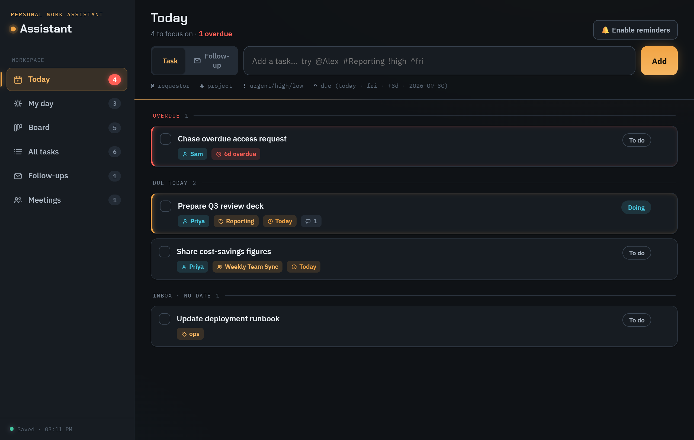
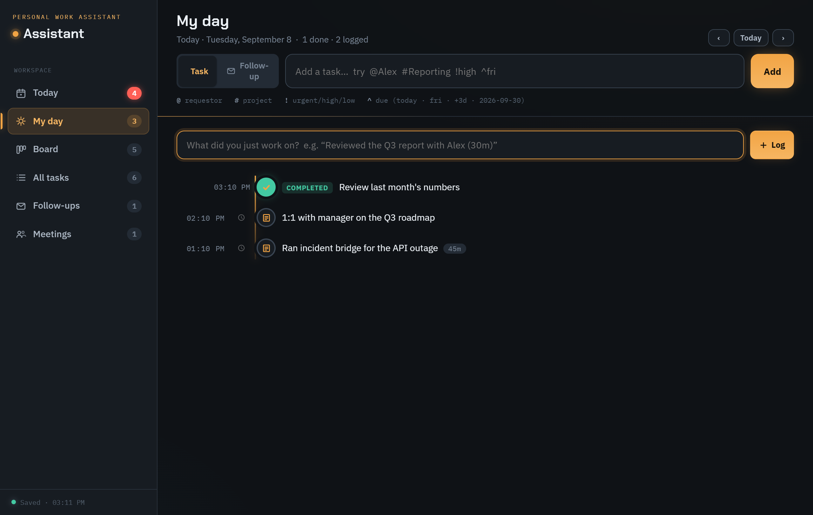

# Work Assistant

A personal app to capture your work so nothing gets lost — tasks, email follow-ups,
and action items assigned to you during meetings. Tracks **who requested** each
task, due dates, and priority.



A no-build static site (vanilla JS) backed by **Supabase** for storage + login,
dressed in a warm-dark "flight deck" theme, and deployable to **Vercel**.

## Run it locally

```bash
cd Assistant
npm install      # first time only
npm start        # serves the static site at http://localhost:3020
```

It talks to Supabase, so it needs the connection set in `public/config.js` and an
internet connection. `npm run dev` runs it with nodemon.

## Where your data lives

Your tasks, meetings and logs are stored in **Supabase** (Postgres) as one JSON
row per account, isolated by **Row-Level Security** so each login only ever sees
its own data. Connection settings live in `public/config.js` — the Supabase
Project URL and `anon` key, both safe to ship (RLS is what protects the data;
never put the `service_role` key there).

## How to use it

### Quick capture (the point)
The bar at the top adds a task in one line. Type naturally and use tokens:

| Token | Means | Example |
|-------|-------|---------|
| `@name` | Requested by | `@Alex` or `@[Alex Rivera]` |
| `#tag` | Project / tag | `#Reporting` |
| `!level` | Priority | `!urgent` `!high` `!low` |
| `^when` | Due date | `^today` `^fri` `^+3d` `^2026-09-30` |

Example: `Prepare Q3 review deck @Alex #Reporting !high ^fri`
Press **Enter**. (Press **/** anywhere to jump to the capture bar.)

Switch the toggle to **Follow-up** to log an email that needs a reply — paste the
message link so you can jump back to it.

### Views
- **Today** — overdue, due today, in-progress, and an inbox of undated captures.
- **My day** — a timeline of what you did each day: free-form activity notes (with
  optional durations like `(45m)`) plus every task you completed, on one tape.
- **Board** — To do / Doing / Done, drag cards between columns.
- **All tasks** — full list with search and filters (status, priority, source,
  requestor, project).
- **Follow-ups** — just the email items awaiting action.
- **Meetings** — make a meeting before a call, then jot each assigned action item
  as it's handed to you; they flow straight into your tasks with the meeting and
  requestor attached.



### Task activity log
Open any task (click it, or the ✎ pencil) to edit every field and keep a running
**activity log** — post comments as work progresses; status changes are recorded
automatically.

### Reminders
On the **Today** view, click *Enable reminders* to get a browser notification for
overdue / due-today tasks while the app is open in a tab.

## Deploy (Vercel + Supabase)

**1. Supabase — create the table.** In the SQL Editor, run:

```sql
create table if not exists public.assistant_state (
  user_id    uuid primary key references auth.users(id) on delete cascade,
  data       jsonb not null default '{"tasks":[],"meetings":[],"logs":[]}'::jsonb,
  updated_at timestamptz not null default now()
);
alter table public.assistant_state enable row level security;
create policy "own state - read"   on public.assistant_state for select using (auth.uid() = user_id);
create policy "own state - insert" on public.assistant_state for insert with check (auth.uid() = user_id);
create policy "own state - update" on public.assistant_state for update using (auth.uid() = user_id) with check (auth.uid() = user_id);
```

**2. Supabase — create your login.** Authentication → Users → **Add user**
(email + password; tick **Auto Confirm User**). Sign-up is not exposed in the app,
so accounts are created here.

**3. Set the connection.** Put your Project URL + `anon` key in `public/config.js`
(Supabase → Project Settings → API).

**4. Vercel — deploy.** Import this GitHub repo. `vercel.json` already configures
it as a static site (no build) serving `public/`, so just click Deploy. Your app
goes live at `<project>.vercel.app`, and every `git push` redeploys it.

## Roadmap (not built yet)
- Microsoft 365 sync (auto-pull flagged Outlook emails + calendar meetings via
  Microsoft Graph) — needs an Entra app registration.
- Deploy behind login.

## License

[MIT](LICENSE) © 2026 Reda Lotfi
